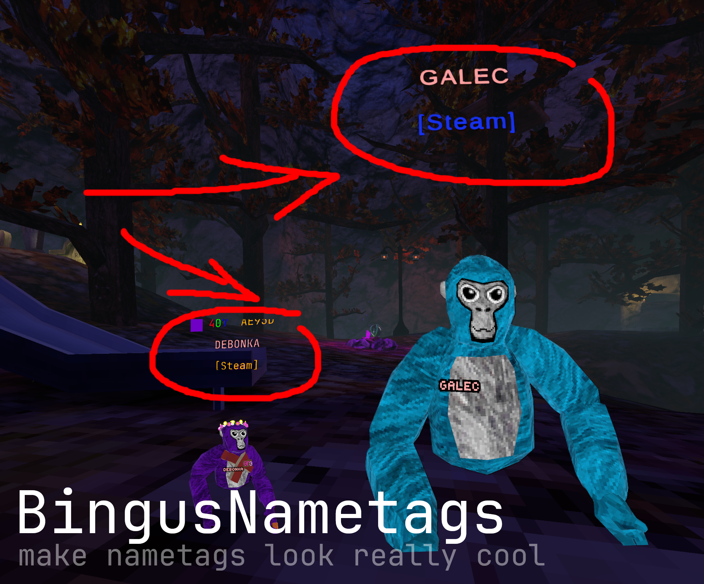

> [!WARNING]
> This project has mostly been replaced by [BingusNametags++](https://github.com/sirkingbinx/BingusNametagsPlusPlus), a better, more configurable, and overall cleaner nametag mod. > I recommend you try using BingusNametags++ over this.

# BingusNametags 
BingusNametags is a customizable name mod for Gorilla Tag. It is customizable with [colors](#file), [fonts](#custom-font), and [plugins](#plugins) which add more nametags.


<!--
This was the original image, I'm replacing them with the new nametags (and more customization showoff)

-->

## Dependencies
> `*` indicate that the dependency is optional when using the mod, but required when building from source.
- [.NET Build Tools](https://visualstudio.microsoft.com/downloads/)
- `*` [GorillaFriends](https://github.com/not-a-bird-09/GorillaFriends)

## Configuration
### File
You can choose what and how to show nametags in the config file. It is named `BingusNametags.cfg` and is located in the same directory as the BingusNametags plugin.
### Custom Font
You can place any `.ttf (font file)` in the same folder as BingusNametags to use that font instead of the default.
If installing via MonkeModManager, place the font in the `BingusNametags` folder.

## Plugins
The plugin system lets you add your own nametags with little-to-no hassle. An official template can be found [here](https://github.com/sirkingbinx/BingusNametagsPluginTemplate).
It implements `template INametag` and `class BingusNametagsPlugin : Attribute` which are used like this:
```cs
//                   ( [name]     [offset] )]
[BingusNametagsPlugin(  "hi"   ,    1.2f   )]
public class MyNametag : INametag
{
    public bool Enabled { get; set; } = true;
    public string Update(VRRig owner) {
        // return a string for the nametag text (supports TextMeshPro formatting)
        // https://docs.unity3d.com/Packages/com.unity.textmeshpro@4.0/manual/RichText.html
        return "";
    }
}
```

## Credits
- Verified users, friending system, and recent player checks from [GorillaFriends](https://github.com/rusjj/gorillafriends) by [RusJJ](https://github.com/rusjj)
